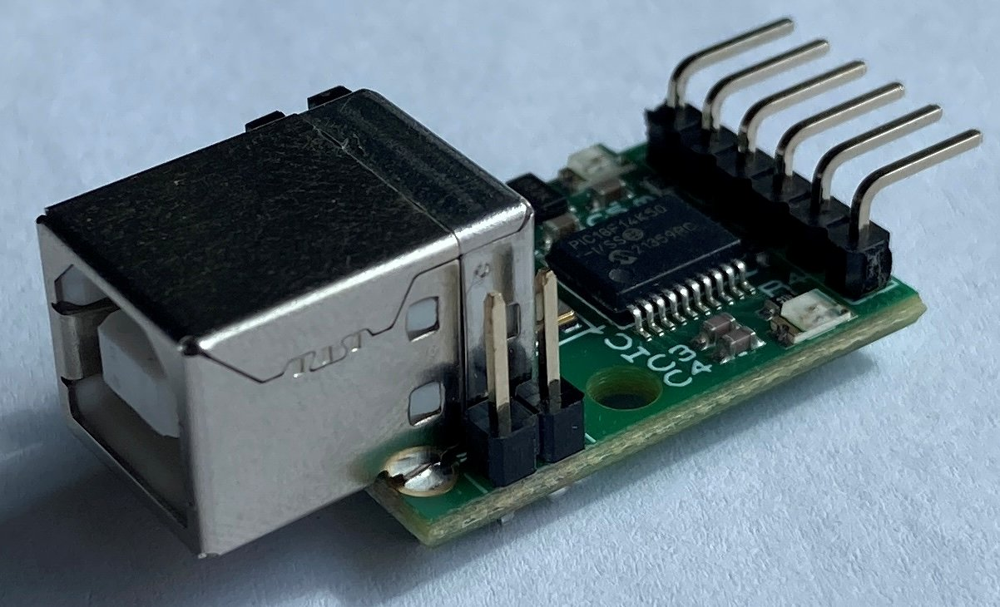

[](https://github.com/andkae/usbiss/actions/workflows/linux.yml) [](https://github.com/andkae/usbiss/actions/workflows/windows.yml)

- [usbiss](#usbiss)
  * [Features](#features)
  * [Releases](#releases)
  * [[CLI](./usbiss_main.c)](#-cli---usbiss-mainc-)
    + [Arguments](#arguments)
    + [Run](#run)
      - [Write](#write)
      - [Read](#read)
  * [[API](./usbiss.h)](#-api---usbissh-)
    + [List](#list)
    + [Init](#init)
    + [Verbose](#verbose)
    + [Open](#open)
    + [Close](#close)
    + [Mode](#mode)
    + [I2C-Write](#i2c-write)
    + [I2C-Read](#i2c-read)
    + [I2C-Write-Read](#i2c-write-read)
  * [Acknowledgment](#acknowledgment)
  * [References](#references)


# usbiss
A API and CLI tool to interface the [USB-ISS](http://www.robot-electronics.co.uk/htm/usb_iss_tech.htm) for Linux and Windows.

<center>  </center>
<br/>


## Features
* CLI interface to read/write arbitrary number of bytes from I2C slave
* Windows/Linux support
* Prebuild Windows excutable for command line
* Easy to use C-API for project integration


## Releases
| Version                                                | Date       | Source                                                                                              | Change log                         |
| ------------------------------------------------------ | ---------- | --------------------------------------------------------------------------------------------------- | ---------------------------------- |
| latest                                                 |            | <a id="raw-url" href="https://github.com/andkae/usbiss/archive/refs/heads/main.zip">latest.zip</a>  |                                    |
| [v0.0.1](https://github.com/andkae/usbiss/tree/v0.0.1) | 2023-08-04 | <a id="raw-url" href="https://github.com/andkae/usbiss/archive/refs/tags/v0.0.1.zip">v0.0.1.zip</a> | initial draft                      |


## [CLI](./usbiss_main.c)

### Arguments
| Argument                  | Description                                                                                                                 | Remark                                                                                    |
| ------------------------- | --------------------------------------------------------------------------------------------------------------------------- | ----------------------------------------------------------------------------------------- |
| -p, --port=[UART]         | USB-ISS belonging _<UART>_ port                                                                                             | Windows: _COM1_ <br /> Linux: _/dev/ttyACM0_                                              |
| -b, --baud=[115200]       | communication speed Host/USB-ISS                                                                                            | UART baud rate                                                                            |
| -m, --mode=[I2C_S_100KHZ] | I2C transfer mode, use _usbiss -h_ for valid modes                                                                          | f.e. _I2C_H_400KHZ_                                                                       |
| -c, --command={cmd}       | I2C access to perform <br /> write: _adr7_ w _b0_ _bn_ <br /> read: _adr7_ r _cnt_ <br /> write-read: _adr7_ w _bn_ r _cnt_ | _adr7_: I2C slave address <br /> _bn_: write byte value <br />_cnt_: number of read bytes |
| -h, --help                | help                                                                                                                        |                                                                                           |
| --verbose                 | enable debug output                                                                                                         |                                                                                           |
| --brief                   | output only relevant USBISS responses                                                                                       | write: exit code only, read: read data only                                               |

### Run
This example modifies the EEPROM [24C256](https://ww1.microchip.com/downloads/en/devicedoc/doc0670.pdf) memory content.

#### Write
Write to device _0x50_ address _0_ the data _0x01 0x02 0x03_. The Arg accepts arbitary write data length, but keep the page overoll in this case in mind.

```bash
sudo ./bin/usbiss -m I2C_H_400KHz -c "0x50 w 0 0 0x01 0x02 0x03"
```

Following output:
```bash
[ INFO ]   USBISS started
[ OKAY ]   USBISS connected
             Baudrate : 115200
             Firmware : 0x09
             Serial   : 00060147
             Mode     : I2C_H_400KHZ
[ OKAY ]   Write 5 bytes to device 0x50
             0:  00 00 01 02 03
[ OKAY ]   ended normally
```

#### Read
Read from device _0x50_ address _0_ 128 bytes.

```bash
sudo ./bin/usbiss -m I2C_H_400KHz -c "0x50 w 0 0 r 128"
```

Following output:
```bash
[ INFO ]   USBISS started
[ OKAY ]   USBISS connected
             Baudrate : 115200
             Firmware : 0x09
             Serial   : 00060147
             Mode     : I2C_H_400KHZ
[ OKAY ]   Write/Read interaction with device 0x50
           Write 2 Bytes
             0:  00 00
           Read 128 Bytes
             00:  01 02 03 05 06 07 08 09  0a 0b 0c 0d 0e 0f 10 11
             10:  12 13 14 15 16 17 18 19  1a 1b 1c 1d 1e 1f 20 21
             20:  22 23 24 25 26 27 28 29  0a 0b 0c 0d 2e 2f 30 31
             30:  32 33 34 35 36 37 38 39  3a 3b 3c 3d 3e 3f 40 41
             40:  0a 0b 0c 0d 1b 71 a4 00  00 00 00 00 00 00 00 00
             50:  00 00 00 00 00 00 00 00  00 00 00 00 00 00 00 00
             60:  00 00 00 00 00 00 00 00  00 00 00 00 00 00 00 00
             70:  00 00 00 00 00 00 00 00  00 00 00 00 00 00 00 00
[ OKAY ]   ended normally
```


## [API](./usbiss.h)

### List
```c
int usbiss_list_uart( char *str, size_t len );
```

List USB-ISS suitable UART ports.

| Arg | Description                |
| --- | -------------------------- |
| str | Found UART ports on system |
| len | max length of string       |

### Init
```c
int usbiss_init( t_usbiss *self );
```

Initialize USB-ISS handle.

### Verbose
```c
void usbiss_set_verbose( t_usbiss *self, uint8_t verbose );
```

Set message level of driver.

| Arg     | Description                                                                            |
| ------- | -------------------------------------------------------------------------------------- |
| verbose | Advanced debug information <br /> 0: no debug output <br /> 1: debug output via printf |

### Open
```c
int usbiss_open( t_usbiss *self, char* port, uint32_t baud );
```

Open connection to USB-ISS.

| Arg                         | Description                                                                  |
| --------------------------- | ---------------------------------------------------------------------------- |
| port=[COM1 \| /dev/ttyACM0] | System path to USB-ISS belonging UART. Provide empty string _""_ for default |
| baud=[115200]               | Baud rate of UART connection. Provide _0_ for default                        |

### Close
```c
int usbiss_close( t_usbiss *self );
```

Close connection to USB-ISS.

### Mode
```c
int usbiss_set_mode( t_usbiss *self, const char* mode );
```

Setup USB-ISS transfer mode.
_Note: Currently only I2C modes supported._

| Arg                         | Description                                                                                                                                                                                  |
| --------------------------- | -------------------------------------------------------------------------------------------------------------------------------------------------------------------------------------------- |
| mode=[USBISS_I2C_S_100KHZ]  | I2C Standard: _USBISS_I2C_S_20KHZ_, _USBISS_I2C_S_50KHZ_, _USBISS_I2C_S_100KHZ_, _USBISS_I2C_S_400KHZ_ <br /> I2C Fast: _USBISS_I2C_H_100KHZ_, _USBISS_I2C_H_400KHZ_, _USBISS_I2C_H_1000KHZ_ |

### I2C-Write
```c
int usbiss_i2c_wr( t_usbiss *self, uint8_t adr7, void* data, size_t len );
```

Write arbitary number of bytes to I2C slave.

| Arg  | Description                    |
| ---- | ------------------------------ |
| adr7 | I2C slave address (7Bit)       |
| data | array with write data          |
| len  | number of bytes in write array |

### I2C-Read
```c
int usbiss_i2c_rd( t_usbiss *self, uint8_t adr7, void* data, size_t len );
```

Read arbitary number of bytes from I2C slave.

| Arg  | Description                        |
| ---- | ---------------------------------- |
| adr7 | I2C slave address (7Bit)           |
| data | array with read data               |
| len  | number of requested bytes for read |

### I2C-Write-Read
```c
int usbiss_i2c_wr_rd( t_usbiss *self, uint8_t adr7, void* data, size_t wrLen, size_t rdLen );
```

Write arbitary number of bytes to I2C slave, sent repeated start and read arbitary number of bytes.
Write and Read data takes place in the same _data_ buffer.

| Arg   | Description              |
| ----- | ------------------------ |
| adr7  | I2C slave address (7Bit) |
| data  | array with read data     |
| wrLen | number of bytes to write |
| rdLen | number of bytes for read |


## Acknowledgment

Special thanks to [AndreRenaud](https://github.com/AndreRenaud) for providing such nice modules. [simple_uart](https://github.com/AndreRenaud/simple_uart) allows
us to run [USBISS](https://github.com/andkae/usbiss) with Linux and Windows.


## References
  * [USB-ISS](http://www.robot-electronics.co.uk/htm/usb_iss_tech.htm)
  * [Simple UART](https://github.com/AndreRenaud/simple_uart)
